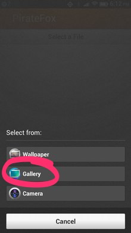
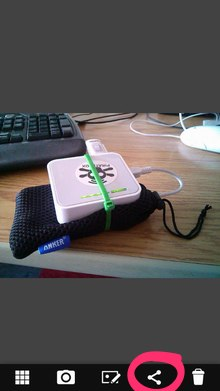
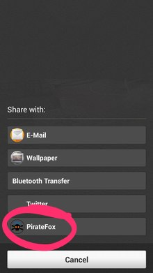

PirateFox
=========

A simple app for uploading files (images, videos, audio) from a Firefox OS device to a connected [PirateBox](http://wiki.daviddarts.com/PirateBox_DIY).

How to Use
----------

First, connect your Firefox OS device to a PirateBox (Settings | Wi-Fi). 

Don't have a PirateBox? [Build yourself one!](http://wiki.daviddarts.com/PirateBox_DIY)

You can then use the app to upload files to the PirateBox in two ways:

### Directly with the app:

Firstly you can send file directly from the app itself: tap the **Send a File** button, select the type of file, crop if given the option, and the file will be uploaded:

### From other apps:

From within any app that supports the "share" function of Firefox OS you can tap the share icon and upload the selected item to a PirateBox directly:

Why can't we just use the browser?
----------------------------------

The current stable Firefox OS version [doesn't support](https://bugzilla.mozilla.org/show_bug.cgi?id=801635) ``<input type="file">`` and so files cannot be uploaded to a PirateBox, the UI of which depends on this for file selection.

This app uses [MozActivity](https://developer.mozilla.org/en-US/docs/Web/API/MozActivity) to allow a device user to select a file (right now limited to images, audio and video) and then simply uploads it to a connected PirateBox.

It does some primitive checking (looking for http://piratebox.lan/ncsi.txt) to discover if it's connected to a PirateBox or not; this isn't intended to verify that the connected device is a PirateBox, simply to flag situations where a user might not realize they didn't point their device at the PirateBox (I've done this myself several times by accident).

How files are uploaded
----------------------

[Another issue with Firefox OS](https://bugzilla.mozilla.org/show_bug.cgi?id=690659) is that it doesn't support passing a filename as the third parameter in the FormData.append method, which means that every file uploaded, if using FormData, ends up with the filename ``blob`` on the PirateBox.

To work around this bug, I avoid using FormData and instead "handcraft" the XMLHttpRequest payload's multipart/form-data payload. It tries to determine the filename from the Blob that the MozActivity returns; if it cannot, it sets the file extension with a generic filename (like ``image.jpg``).

The XMLHttpRequest sends the file to Droopy on the PirateBox on port 8080 using field name ``upfile``.

Technical Assumptions
---------------------

The app makes some assumptions:

 1. Your PirateBox is at http://piratebox.lan/
 2. [Droopy](http://stackp.online.fr/?p=28) is running on port 8080 (http://piratebox.lan:8080/).
 